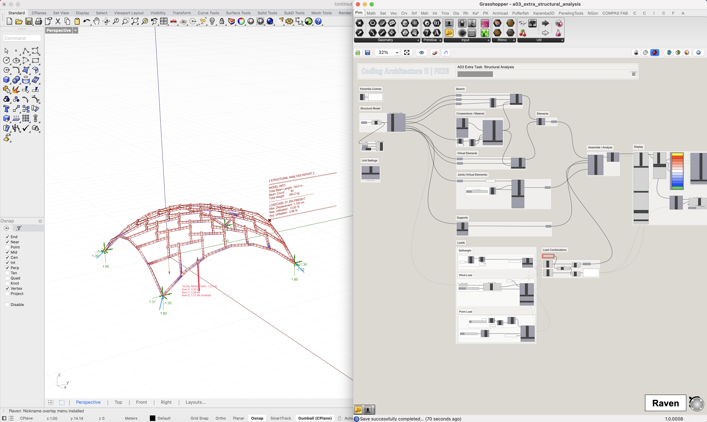

# Coding Architecture II: FS26
## Week 10 – Structural Analysis

> Interfacing with structural analysis tools to evaluate and optimize the performance of our designs.

## Table of Contents

- [Introduction](#introduction)
- [Structural Design Fundamentals](#structural-design-fundamentals)
- [Loads, Combinations & Supports](#loads-combinations--supports)
- [Structural Verification](#structural-verification)
- [Finite Element Method (FEM)](#finite-element-method-fem)
- [Reciprocal Frames: Structural Logic](#reciprocal-frames-structural-logic)
- [Karamba3D Workflow](#karamba3d-workflow)
- [Slides](#slides)

## Introduction

This week introduces structural analysis as a critical layer in the design-to-fabrication pipeline. Geometry alone is no longer sufficient — we now evaluate whether our systems actually perform.

We begin with a guest lecture by Patrick Studer, focusing on the fundamentals of structural engineering, followed by a hands-on session using **Karamba3D** to simulate and assess the performance of your timber structures.

The goal is to understand how forces flow through your system and how design decisions affect structural behavior.

## Structural Design Fundamentals

Structural engineering translates design intent into **load-bearing systems**.

Key objectives:
- **Safety**: prevent failure  
- **Stability**: ensure global equilibrium  
- **Efficiency**: minimize material use  

Typical workflow:
1. Concept / draft  
2. Modelling and calculation  
3. Dimensioning and verification  
4. Detailed design  

Structural thinking must be integrated early. The system, not the shape, defines performance.

## Loads, Combinations & Supports

Structures are governed by the loads they carry. These include permanent loads (self-weight), variable loads (wind, snow, occupancy), and exceptional loads (e.g. earthquakes). Their magnitude depends on site conditions and geometry, and they are applied as line or surface loads within the model.

Since loads act simultaneously, they are combined using safety factors. Two limit states define the design space: **ULS** for structural safety and **SLS** for usability (deflection, vibration). Variable loads are reduced using combination factors (ψ) to represent realistic scenarios.

Structural behaviour is equally defined by **boundary conditions**. Supports such as roller, pinned, or fixed constraints directly influence force distribution and deformation. Identical geometry can behave entirely differently depending on how it is supported.

## Structural Verification

A structure must satisfy both **safety (ULS)** and **usability (SLS)** criteria. This involves checking internal forces such as normal force (tension/compression), bending, and shear against material capacity, while also ensuring acceptable deflection and vibration. Only when both conditions are met is a design considered valid.

## Finite Element Method (FEM)

FEM is the core computational method for structural analysis.

### Concept

- Continuous geometry is discretized into **finite elements**  
- Each element is connected via nodes  
- Forces and displacements are computed numerically  

### Workflow

1. Define geometry (lines → structural members)  
2. Assign material and cross-section  
3. Define supports (boundary conditions)  
4. Apply loads  
5. Solve system  
6. Interpret results  

FEM transforms geometry into a **calculable mechanical system**.

## Reciprocal Frames: Structural Logic

Your design system is evaluated structurally.

### Key Properties

- Elements form a **closed support loop**  
- No central support required  
- Load transfer occurs through **mutual support**  
- Forces circulate within the system  

### Structural Implications

- Efficient spanning with short elements  
- Reduced dependency on complex joints  
- Curved geometries increase stiffness (self-bracing)  

For analysis, joints are often abstracted into simplified connections.

## Karamba3D Workflow

We translate our timber models into structural simulations using the provided analysis template. 

### Resources
- [Grasshopper Definition](../../assignments/A03-design-project/a03_extra_structural_analysis.ghx)
- [Python Script](../../assignments/A03-design-project/a03_extra_structural_analysis.py)

The Grasshopper file includes a JSON exporter for your timber model. Use the provided example model as a reference and replace it with your own design. 

The workflow is designed to be plug-and-play. For your information, here is the underlying logic:

### Pipeline

1. Convert geometry into line elements and generate virtual connector elements
2. Assign cross-sections and material properties  
3. Define supports  
4. Apply loads (self-weight, wind, etc.)  
5. Run analysis  
6. Evaluate results  

### Outputs

- Utilization (capacity vs demand)  
- Deflection  
- Internal forces  

This allows iterative refinement of your design based on performance.

##  Slides

    

        ↑ click to open ↑
    

